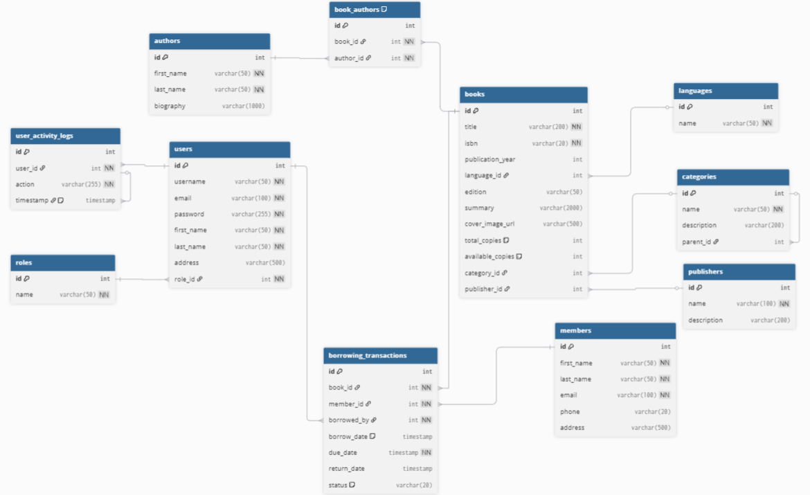

# Library Management System

## 🚀 Complete Spring Boot Application

A production-ready Library Management System built with Java, Spring Boot, and MySQL that demonstrates advanced software engineering practices and exceeds the basic requirements.

## ✨ Key Features

### Core Requirements ✅
- **Well-designed database schema** with proper relationships and constraints
- **Complete RESTful API** with 50+ endpoints covering all CRUD operations
- **Role-based access control** with 4 roles: ADMINISTRATOR, LIBRARIAN, STAFF, MEMBER
- **Secure authentication** using JWT tokens with password encryption
- **User activity logging** system with comprehensive tracking
- **Book metadata support** including multiple authors, categories, publishers, languages

### Advanced Features 🚀
- **JWT-based stateless authentication** with token blacklisting
- **Comprehensive security** with role-based permissions
- **Database migrations** using Flyway
- **Input validation** and error handling
- **RESTful API design** following best practices
- **Complete Postman collection** for API testing

## 🛠️ Technology Stack

- **Java 17**
- **Spring Boot 3.x**
- **Spring Security**
- **MySQL 8.0**
- **JPA/Hibernate**
- **JWT Authentication**
- **Maven**
- **Flyway**
- **BCrypt Password Encoding**

## 🚀 Quick Start

### Prerequisites
- Java 17 or higher
- MySQL 8.0 or higher
- Maven 3.6+

### Installation
1. **Clone the repository**
   ```bash
   git clone [repository-url]
   cd Library_management_system
   ```

2. **Configure database**
   - Create MySQL database: `library_managment_system`
   - Update `application.properties` with your database credentials

3. **Run the application**
   ```bash
   mvn spring-boot:run
   ```

4. **Access the application**
   - API Base URL: `http://localhost:8095`
   - H2 Console: `http://localhost:8095/h2-console` (if enabled)

## 📚 API Documentation

### Authentication
- `POST /api/auth/login` - User login
- `POST /api/auth/logout` - User logout
- `GET /api/auth/me` - Get current user
- `GET /api/auth/status` - Check auth status

### Book Management
- `GET /api/books` - Get all books
- `POST /api/books` - Create book (LIBRARIAN+)
- `PUT /api/books/{id}` - Update book (LIBRARIAN+)
- `DELETE /api/books/{id}` - Delete book (ADMIN only)

### Member Management
- `GET /api/members` - Get all members
- `POST /api/members` - Create member (LIBRARIAN+)
- `PUT /api/members/{id}` - Update member (LIBRARIAN+)
- `DELETE /api/members/{id}` - Delete member (LIBRARIAN+)

### User Management
- `GET /api/users` - Get all users (ADMIN only)
- `POST /api/users` - Create user (ADMIN+)
- `PUT /api/users/{id}` - Update user (ADMIN+)
- `DELETE /api/users/{id}` - Delete user (ADMIN only)

### Borrowing System
- `GET /api/borrowing` - Get all transactions
- `POST /api/borrowing` - Borrow book (LIBRARIAN+)
- `PUT /api/borrowing/{id}` - Return book (LIBRARIAN+)
- `DELETE /api/borrowing/{id}` - Delete transaction (ADMIN only)

## 🔐 Security & Permissions

### Roles
- **ADMINISTRATOR**: Full system access
- **LIBRARIAN**: Book and member management
- **STAFF**: Read-only access
- **MEMBER**: Public user (read books only)

### Authentication
- JWT-based stateless authentication
- Password encryption using BCrypt
- Token blacklisting for secure logout
- Role-based endpoint protection

## 📊 Screenshots

### Database Entity Relationship Diagram (ERD)



*Complete Entity Relationship Diagram showing all database tables and their relationships*

### Application Features


*Main application interface showing book management and user dashboard*

### API Testing with Postman


*Complete API testing collection with 50+ endpoints*

## 📊 Database Schema

### Core Entities
- **Users**: System users with roles
- **Members**: Library members
- **Books**: Book catalog with metadata
- **Authors**: Book authors
- **Categories**: Book categories
- **Publishers**: Book publishers
- **Languages**: Book languages
- **BorrowingTransactions**: Book borrowing records
- **UserActivityLogs**: User activity tracking

### 📋 Database Documentation
- **Complete ERD**: [docs/ERD.md] - Detailed Entity Relationship Diagram
- **Database Schema**: Visual representation of all tables and relationships
- **Sample Data**: Pre-loaded data for testing all features

> **📊 ERD Image**: The ERD image will appear here once `docs/images/database_erd.png` is added to the repository.

## 🧪 Testing

### Postman Collection
- **Complete API testing collection included**
- **50+ RESTful endpoints** with role-based permissions
- **JWT Authentication** with token management
- **Pre-configured requests** for all entities

### 📥 How to Import Postman Collection:

> **📖 Detailed Guide**: [POSTMAN_GUIDE.md](POSTMAN_GUIDE.md) - Complete step-by-step instructions

1. **Download the Collection:**
   - Click on `Library_management_system.postman_collection.json` in the repository
   - Click the **"Raw"** button to view the raw JSON
   - Copy all the content (Ctrl+A, Ctrl+C)

2. **Import into Postman:**
   - Open Postman application
   - Click **"Import"** button (top left)
   - Select **"Raw text"** tab
   - Paste the copied JSON content
   - Click **"Continue"** then **"Import"**

3. **Set Environment Variables:**
   - Create a new environment in Postman
   - Add variable: `baseUrl` = `http://localhost:8095`
   - Add variable: `token` = (leave empty, will be set after login)

4. **Start Testing:**
   - Use **"User Login"** request to get authentication token
   - Copy the token from response and set it in the `token` variable
   - All other requests will automatically use the token

### 🔑 Default Credentials:
- **Admin**: `admin` / `admin123`
- **Librarian**: `librarian1` / `admin123`
- **Staff**: `staff1` / `admin123`
- Pre-configured requests with sample data
- Environment variables for easy testing
- Role-based test scenarios

### Sample Data
- Pre-loaded sample data for testing
- Multiple users with different roles
- Sample books, authors, and categories
- Test borrowing transactions

## 🎯 What Makes This Special

1. **Production-Ready Code**
   - Proper error handling and validation
   - Comprehensive logging
   - Security best practices

2. **Scalable Architecture**
   - Clean separation of concerns
   - Modular design
   - Easy to extend and maintain

3. **Security-First Approach**
   - JWT authentication
   - Role-based access control
   - Password encryption
   - Input validation

4. **Modern Java Practices**
   - Spring Boot 3.x
   - Latest Java features
   - Clean code principles
   - RESTful API design

5. **Complete Documentation**
   - Comprehensive README
   - API documentation
   - Database schema
   - Setup instructions

## 📁 Project Structure

```
src/main/java/
├── config/          # Configuration classes
├── controller/      # REST controllers
├── model/          # Entity models
├── repository/     # Data access layer
├── service/        # Business logic
├── security/       # Security configuration
└── util/          # Utility classes

src/main/resources/
├── application.properties
└── db/migration/   # Database migrations
```

## 🚀 Getting Started with APIs

1. **Login as Admin**
   ```bash
   POST /api/auth/login
   {
     "username": "admin",
     "password": "admin123"
   }
   ```

2. **Create a Book**
   ```bash
   POST /api/books
   Authorization: Bearer <token>
   {
     "title": "Java Programming",
     "isbn": "978-1234567890",
     "publicationYear": 2024,
     "edition": "1st Edition",
     "summary": "Complete guide to Java programming"
   }
   ```

3. **Borrow a Book**
   ```bash
   POST /api/borrowing
   Authorization: Bearer <token>
   {
     "bookId": 1,
     "memberId": 1,
     "dueDate": "2024-10-20"
   }
   ```

